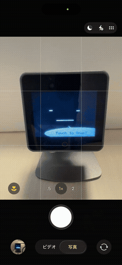

# SnapChan p0

> 「スタックチャンも同じ瞬間を見ていた」

スタックチャン（M5Stack CoreS3）をタッチするとカウントダウンが始まり、内蔵カメラがシャッターを切る。
撮影後、QRコードをスキャンするとブラウザから写真を確認・ダウンロードできる。



---

## 動作フロー

```
[待機] "Touch to Snap!"
  ↓ 画面下半分をタッチ
[カウントダウン] 3 → 2 → 1 → フラッシュ
  ↓ 自動
[撮影完了] avatar が "Got it!" と表示
  ↓ 自動（1.5秒後）
[WiFi接続時] QRコード表示 → スキャンしてブラウザで写真を見る
[WiFi未接続時] 撮った写真をそのままM5Stack画面に表示
  ↓ 画面をタッチ
[待機] に戻る
```

---

## セットアップ

### 必要なもの

- M5Stack CoreS3
- PlatformIO

### ビルド & フラッシュ

```bash
pio run --target upload
```

### WiFi設定

シリアルモニタを開き（921600bps）、以下のコマンドを送信する。
NVSに保存されるため次回起動から自動接続。

```
WIFI:yourSSID:yourPassword
```

または以下で実行。

```bash
printf "WIFI:yourSSID:yourPassword\r\n" > /dev/ttyACM0
```

### シリアルコマンド一覧

| コマンド | 説明 |
|---|---|
| `WIFI:ssid:pass` | WiFiに接続してNVSに保存 |
| `WIFI:CLEAR` | WiFi認証情報を消去 |
| `STATUS` | 状態をJSON出力 |

---

## ブラウザでの写真閲覧

1. 撮影後に表示されるQRコードをスキャン
2. `http://<M5StackのIP>/` をブラウザで開く
3. 写真を確認・ダウンロード

WiFiが未接続の場合はQRコードの代わりに写真がM5Stack画面に直接表示される。

---

## アーキテクチャ

### ファイル構成

```
src/
├── main.cpp          - setup(), loop(), グローバルインスタンス定義
├── globals.h         - 共有インスタンスのextern宣言（avatar, server, preferences）
├── wifi.h/.cpp       - WiFi接続・NVS認証情報管理
├── camera.h/.cpp     - カメラ初期化・PSRAMへの撮影保存
├── snap.h/.cpp       - カウントダウン・QRコード・UI フロー
└── web_server.h/.cpp - HTTPエンドポイント（/ と /photo.jpg）・HTML
```

### HTTPエンドポイント

| パス | メソッド | 説明 |
|---|---|---|
| `/` | GET | SnapChan HTML（no-cacheヘッダー付き） |
| `/photo.jpg` | GET | 最新の撮影画像（PSRAMからchunked転送） |

---

## 使用ライブラリ

| ライブラリ | バージョン | ライセンス |
|---|---|---|
| [M5Unified](https://github.com/m5stack/M5Unified) | 0.2.7 | MIT |
| [M5Stack-Avatar](https://github.com/meganetaaan/M5Stack-Avatar) | ^0.10.0 | MIT |
| [ESPAsyncWebServer](https://github.com/ESP32Async/ESPAsyncWebServer) | latest | LGPL-3.0 |
| [AsyncTCP](https://github.com/ESP32Async/AsyncTCP) | latest | LGPL-3.0 |

詳細は [LICENSES.md](LICENSES.md) を参照。

---

## 既知の制約（p0スコープ）

- 写真は再起動すると消える（PSRAMバッファのため）
- 保存できる写真は常に最新の1枚のみ
- avatarのフォントがASCIIのみのためspeechTextは英語
- WiFi設定はシリアルコマンドで行う

---

## 将来の計画（v1）

Firebase を使ってスマホカメラとM5Stackカメラを同時撮影し、2枚を並べてブラウザ表示する。

| 機能 | p0 | v1 |
|---|---|---|
| スマホカメラ | 手動 | 自動（Firebase Realtime DBでトリガー同期） |
| 写真保存 | PSRAM（揮発） | Firebase Storage |
| ブラウザ配信 | M5Stack直接 | Firebase Hosting |
